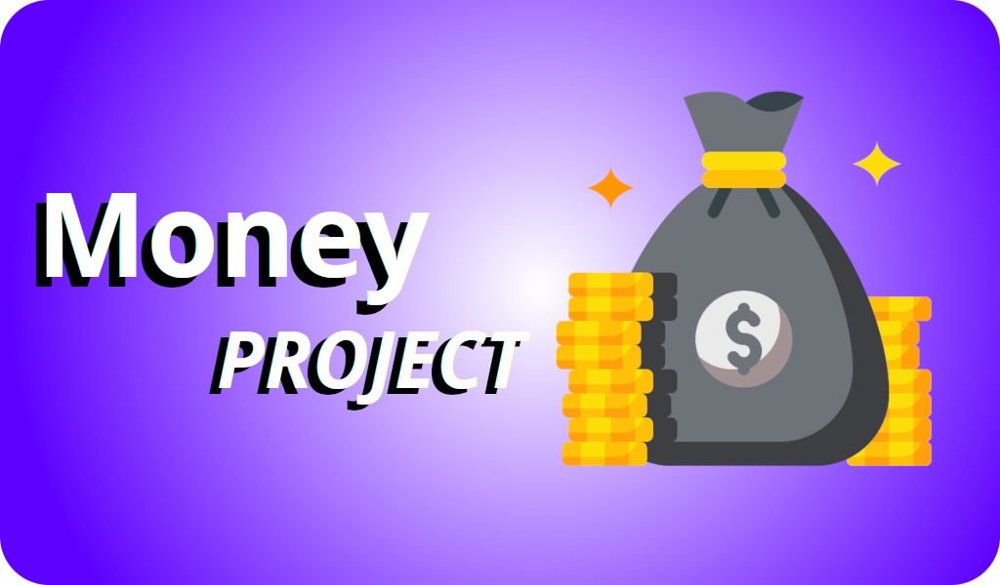

Money Project é um trabalho acadêmico(TCC), que foi criado a partir de uma pesquisa feita para o entendimento de um problema. Money Project é um app com foco em **Educação Financeira open source**, onde é possível você contribuir ou até mesmo fazer um **fork** e continuar ele seja como um trabalho acadêmico, assim como é a proposta original ou usá-lo para outra forma. Ele foi construído usando o **framework Flutter** na sua versão **3.0** 

A parte escrita desse trabalho acadêmico, pode ser encontrado no [Overleaf](https://www.overleaf.com/read/hmvqqmhqsbhx).

## Requirementos

Para que você consiga entender como o projeto foi construído, e deseja rodar/modificar, é necessário que você saiba os seguintes conhecimentos:

* [Dart](https://www.youtube.com/watch?v=PgRv_aeqf-4&list=PLRpTFz5_57cseSiszvssXO7HKVzOsrI77)
* [Flutter](https://www.youtube.com/watch?v=Wdn6peqH9ZQ&list=PLlBnICoI-g-fuy5jZiCufhFip1BlBswI7)
* [ValueNotifier](https://www.youtube.com/watch?v=zV1X9vwYcdI&list=PLlBnICoI-g-eG0eVkHu2IaO48TljxPjPq)
* [SharedPreferences](https://www.youtube.com/watch?v=x5ccn2Jm1vc&t=333s)

> Clicando em cada nome das tecnologias, você será redirecionado para uma vídeo(s) aula(s) sobre, para que você possa conhecer/aprimorar os seus conhecimentos.

Para que consiga trabalhar com o projeto, é recomendado uma IDE/Editor de Texto. Eu recomendo usar o [Visual Studio Code](https://code.visualstudio.com/).

Caso não consiga rodar por causa de dependências desatualizadas ou não baixadas, use o comando a seguir.

```console
flutter pub get
```

Caso não consiga rodar e de certa forma não tenha um erro aparente use o comando abaixo para entender o que possa ser.

```console
flutter doctor -v
```

## Libs

O projeto usa duas libs importantes para o funcionamento do app. A primeira é o [flutter-modular](https://modular.flutterando.com.br/docs/intro/) para gerenciamento de rotas e o [fl-chart](https://pub.dev/packages/fl_chart) para criação dos gráficos.

# Estrutura

A estrutura do app segue a ideia do [Clean Architecture](https://fullcycle.com.br/o-que-e-clean-architecture/), para um melhor entendimento do projeto, e para que seja possível escalar no futuro. O projeto é separado em pastas que são consideradas módulos, onde cada módulo vai ter a sua regra de negócio, quanto a parte visual, onse será aplicado o **Flutter**. Cada módulo, terá um arquivo específico para gerencias as suas rotas, esse por sua vez, só existe por causa da lib **flutter-modular**.

# :star2: Melhorias

Essa parte seja interessante, caso você queira levar esse projeto para frente, aqui damos algumas possibilidades de melhorias.

- Geração de PDF/Planilha
- Compartilhamento de dados por **social media**
- Criação de perfis de usuários
- Tela de inputs para Investimentos
- Tela de visualizações de dados dos Investimentos
- Integração de API’s de **bancos digitais**
- Criação de auto ajuda no app, identificação das features
- Criação de um **Design System**
- Implementação de ****Gamificação**** no app
- Criação de versões **Web/Desktop [Multiplataforma]**